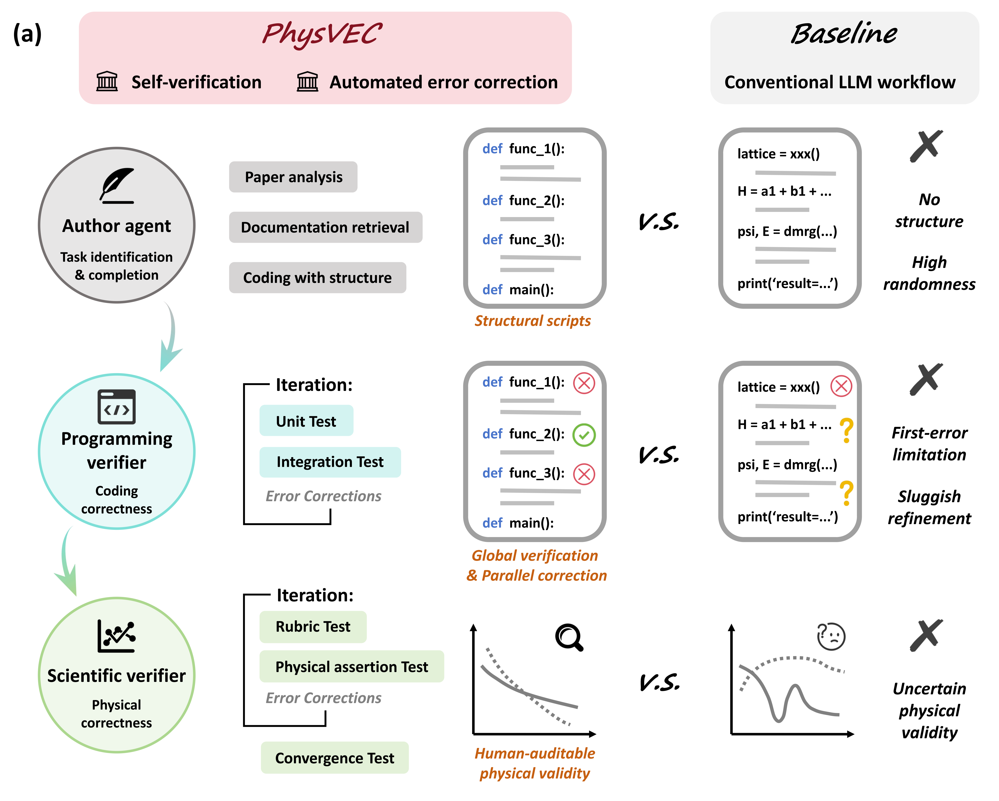
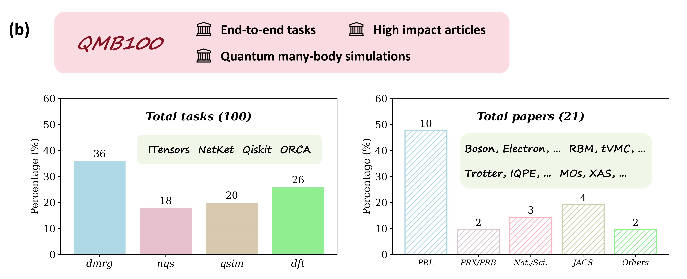

<h1 align="center">Towards Verifiable and Self-Correcting AI Physicists for Quantum Many-Body Simulations</h1>

Welcome to PhysVEC and QMP-Bench!

While large language models (LLMs) promise to revolutionize automated scientific discovery, their application in rigorous real-world physical research is stalled by two critical barriers: a lack of realistic evaluation benchmarks and systemic LLM hallucinations. Here, we address both problems. We introduce QMP-Bench, a pioneering end-to-end research-level benchmark in quantum many-body simulation consisting of $100$ reproduction tasks extracted from $21$ high-impact prestigious journals, presenting a challenge even for current frontier LLMs. To establish a paradigm for reliable and transparent AI agents for physics research, we present PhysVEC, a multi-agent framework that enforces self-verification and error correction. PhysVEC seamlessly integrates programming and scientific verifiers to assess and improve coding correctness and principle-based physical validity, yielding interpretable evidence and error correction at each step. PhysVEC significantly outperforms existing LLM baselines on various scenarios in QMP-Bench and presents inference-time improvements, successfully transforming unreliable AI generations into accurate physical reproductions, providing a new framework for assisting and accelerating scientific research.

# Overview
## PhysVEC framework

<p align="center">
  
</p>

- **Cooperative multi-agent design.** PhysVEC coordinates three agents: an **Author** agent, a **Programming verifier**, and a **Scientific verifier**.
- **Author agent.** Reads the input article and produces the code to complete the target task.
- **Programming verifier.** Runs programming tests to verify programming correctness and fix **syntax** errors.
- **Scientific verifier.** Runs scientific tests to verify **physical** validity (physics-informed checks) and **outputs the reproduced results**.


## QMP-Bench benchmark dataset

<p align="center">
  
</p>

**QMP-Bench** is the first **end-to-end, research-level** benchmark dataset consisting of **100** quantum many-body simulation tasks from **21 high-impact articles**. Each task requires **reproducing published results from the source paper**. 

**Composition:** **36** tensor-network tasks (**ITensors**/dmrg), **18** neural-ansatz tasks (**NetKet**/nqs/nnwf), **20** quantum-circuit tasks (**Qiskit**/qsim/qcmb), and **26** DFT tasks (**ORCA**/dft/dft_qc).


# Code Structure
The repository is split into two Git branches. The **main** branch contains the full workflows and outputs for the **dmrg**, **nqs**, and **qsim** settings. The **DFT** branch is the DFT-only counterpart, with the same style of content scoped to **dft**.

**Scope of this document.** The guide below refers to the **main** branch unless stated otherwise. The **DFT** branch mirrors the same structure and configuration, except for a few path or file naming differences.

## User interface
Executable entry points live under [`run_sh/`](run_sh/). They are **shell scripts (`.sh`)** so you can open any file in a text editor and **set the main parameters in one place** (paths, task names, model, etc.) before execution.

- "run_task_workflow_compprog_v2.sh": execute the programming tests in PhysVEC (including the Author phase).
- "run_task_workflow_compscit_v4.sh": execute the scientific tests after the prior programming tests in PhysVEC. 
- "run_task_baseline_ReAct_v2.sh": execute the programming tests for baselines (including the Author phase). 
- "run_task_baseline_compscit_v4.sh": execute the baseline scripts to get results (no further scientific tests).  

## Pipeline construction
The experiment pipelines are included under [`src/`](src/) directory. 

### PhysVEC pipeline
- For **programming tests**, the pipeline is defined in 'task_workflow_compprog_v2.py' (latest version). 
- For **scientific tests**, the pipeline is defined in 'task_workflow_compscit_v4.py' (latest version). 

### Baseline pipeline
- For **programming tests**, the pipeline is defined in 'task_baseline_ReAct_v2.py' (latest version). 
- For **result production**, the pipeline is defined in 'task_baseline_compscit_v4.py' (latest version). 

Note: the files are often named as 'xxx_vi', here i denotes the update version. The largest i number represents the latest and current version. 

## Agent definitions
The low-level definitions and implementations of the agents live under the [`src/`](src/) directory.

### QMBagents.py
[`QMBagents.py`](src/QMBagents.py) implements the **infrastructure** of the PhysVEC framework: the `QMBagent` base class, shared LLM and filesystem plumbing, and the basic operating logics of the Author agent, Programming verifier, and Scientific verifier.

### repair_agents.py
[`repair_agents.py`](src/repair_agents.py) defines agent **subclasses of `QMBagent`** that implement the error-correction methods of the framework. The methods are called when a agent is required to repair the artifact.

### scitest_agents.py
[`scitest_agents.py`](src/scitest_agents.py) defines **subclasses of `QMBagent`**. The methods there supplement the methods called in the Scientific tests.

### preverify_agents.py
[`preverify_agents.py`](src/preverify_agents.py) defines **subclasses of `QMBagent`**. This file defines the Verifier library builder agent. 

### ReAct_agents.py
[`ReAct_agents.py`](src/ReAct_agents.py) defines **baselines** used in this work. 

## Benchmark dataset

### Task descriptions
The dataset is stored under [`Paper_dataset/`](Paper_dataset/) directory. There are several subdirectories corresponding to each topic. 

For example, the tasks for 'dmrg' topic is under 'Paper_dataset/dmrg/tasks'. Each task is stored as a json file. 


### Source articles
The dataset also includes the source .tex file of every targetted article. The .tex files are downloaded from arxiv website. 

For example, user can find the original .tex file under 'Paper_dataset/dmrg/sources'.  


## Configurations

### LLM API calling

#### Pure text calling
Throughout the project, we use the `_send_chat` method in [`QMBagents.py`](src/QMBagents.py) for text-only LLM calls. It utilizes low-level helpers in [`utils/`](utils/) that are tied to your LLM API provider and credentials.

We provide [`utils/send_chat_openrouter.py`](utils/send_chat_openrouter.py) as a ready-to-use reference adapter. After adding `OPENROUTER_API_KEY` to the project-root `.env`, it can be used directly and is currently the default provider in `_send_chat`. If you write your own adapter (for example, `utils/send_chat_yourAPI.py`), add it under `utils/` and extend the `api_type` routing in `_send_chat` to select it. [`utils/send_chat_yidong.py`](utils/send_chat_yidong.py) is the adapter used in our own environment, but its service and credentials are not generally available to other users; OpenRouter is the recommended directly usable option.

#### MCP calling
In the pipeline, API calling with MCP tools is also necessary. We realize this by the `_send_chat_through_mcp_dynamic` method in [`QMBagents.py`](src/QMBagents.py). This method calls `send_chat_through_mcp_dynamic` in [`utils/MCP_toolbox.py`](utils/MCP_toolbox.py).

With your own API setting, you can modify the provider classes and routing in [`utils/MCP_toolbox.py`](utils/MCP_toolbox.py) accordingly, such as the URL and model names. The provider option `MCP_LLM_PROVIDER` is defined near the top of this file and defaults to `openrouter`, which works directly with `OPENROUTER_API_KEY`. The provider wrappers used in our internal environment are retained for reproducibility but are not generally available to other users.

### MCP servers
All MCP servers are constructed under [`MCP_servers/`](MCP_servers/) directory. 

PhysVEC includes 'filesystem-mcp', 'program-mcp' and 'retrieve-mcp':

- filesystem-mcp: enables the agent to read/write/... files in the specified directories. We cloned and refined the server from https://github.com/MarcusJellinghaus/mcp_server_filesystem. 
- program-mcp: enables the agent to execute python/julia/ORCA scripts. 
- retrieve-mcp: enables the agent to search in the local knowledge base. 

We utilize LangChain to realize mcp-enabled API calls. User can furthur modefy the behavior in 'utils/MCP_toolbox.py'


# Setup guideline

## Step1: environment
After cloning the project, create a Python venv and run `pip install -r requirements.txt`. For Julia (if you want to run dmrg tasks), use the root [`Project.toml`](Project.toml) and [`Manifest.toml`](Manifest.toml): from the repo root run `julia --project=. -e "using Pkg; Pkg.instantiate()"` to install the required packages.

## Step2: MCP servers
You need to initiate all three MCP servers under `MCP_servers` directory. For this step, you should keep the same venv activated. 

### filesystem-mcp
1. cd into this sub-directory. 
2. run `pip install -e .`. 
3. Note: DO NOT create a seperate venv!

### program-mcp
1. cd into this sub-directory. 
2. run `pip install -e .`. 
3. Note: DO NOT create a seperate venv!

### retrieve-mcp
1. cd into this sub-directory. 
2. run `pip install -e .`. 
3. Note: DO NOT create a seperate venv!

#### How to build local knowlege base:
1. Third-party repositories/libraries are stored in `authority_library/` directory. However, ChromaDB need to be built upon these original libraries for the following pipeline. 
2. cd into `MCP_servers/retrieve-mcp`. 
3. run `build_vector_store.sh` to build the ChromaDB for wanted libraries. 
4. You can also use `check_vector_store.sh` and `delete_vector_store.sh` to manage the local knowledge base. 


## Step3: LLM API configuration
You need to **configure your LLM API** (access keys, base URL, model names) **for this project**; details are also in **Configurations** above.

### API keys
You can store your own API keys (e.g. an OpenRouter key) in the `.env` file in the project root. Remember to include `.env` in `.gitignore`. You also need to update [`config.py`](config.py) when adding keys or configuration for your own provider.

For the provided OpenRouter adapter, add:

```bash
OPENROUTER_API_KEY=your_key_here
```

### Pure text calling configuration
We provide [`utils/send_chat_openrouter.py`](utils/send_chat_openrouter.py) as a complete adapter that can be used directly. Once `OPENROUTER_API_KEY` is present in `.env`, `_send_chat` uses OpenRouter by default. When using OpenRouter, set the run scripts to valid OpenRouter model IDs such as `qwen/qwen3-max`.

To use another provider, follow the same adapter structure and add a module such as `utils/send_chat_yourAPI.py`. Then update `_send_chat` in [`QMBagents.py`](src/QMBagents.py) with an `api_type="yourAPI"` branch that dispatches to your adapter using the same function signature and `(response_text, status_code, token_dict)` return shape.

### MCP calling configuration
[`utils/MCP_toolbox.py`](utils/MCP_toolbox.py) provides the LangChain-compatible `ChatOpenRouter` wrapper. `MCP_LLM_PROVIDER` near the top of this file defaults to `openrouter`, so the same `OPENROUTER_API_KEY` works directly for MCP calls.

To add another MCP provider, define a LangChain-compatible wrapper such as `ChatYourAPI`, add an `MCP_LLM_PROVIDER == "yourAPI"` branch in `send_chat_through_mcp_dynamic`, and configure its URL, model names, and credentials. You do not need to modify the other method definitions in this file. The internal provider wrappers remain in the source code as examples, but external users should normally use OpenRouter or their own `yourAPI` adapter.

### Check before use
We recommend the user to test the LLM API configurations separately before actually running the whole PhysVEC pipeline.

OpenRouter example (adjust the import if your `PYTHONPATH` layout differs):

```python
from utils import send_chat_openrouter

response, status_code, token_dict = send_chat_openrouter.send_chat_openrouter(
    user_model="qwen/qwen3-max",
    role_prompt="You are a helpful assistant.",
    user_prompt="Who are you?",
    temperature=0.1,
    top_p=0.9,
    iscaltoken=True,
)

print(response)
print(status_code)
print(token_dict)
```

You can also run the included real connectivity test before starting the full workflow (it sends one low-token request):

```bash
python tests/test_send_chat_openrouter.py
```

## Step4: run pipeline
The executable user interfaces are provided in **Code Structure/User interface** above. 

You can adjust the settings in .sh scripts:
- Task selections
- LLM choices for each step/agent.
- Saving directories. 
- Sandbox directories. 

You may begin with: run_sh/run_task_workflow_compprog_v2.sh (run_sh/run_task_ReAct_v2.sh) to produce PhysVEC (baseline) reproduction scripts. And run_sh/run_task_workflow_compscit_v4.sh (run_sh/run_task_baseline_compscit_v4.sh) for PhysVEC (baseline) scientific tests and final reproduction. 

## Addition: prepare Verifier library
See more information in 'Methods' in our paper. 

The Verifier library is stored under `CodeVerifier_library_auto/`. 

For each topic (e.g. dmrg), there is a sub-directory containing all verified scripts generated by the Verifier library builder agent. In `CodeVerifier_library_auto/CodeVerifier_library_dmrg/verifier_code`, there are already several verifed (executable) julia scripts. And `CodeVerifier_library_auto/CodeVerifier_library_dmrg/xxx_elements` serve as the builder agent's workspace for each script. 

To add more verifed scripts, you need to:
1. Under the corresponding topic sub-directory, you create a new folder named as 'xxx_elements'. 
2. In that folder, you create a 'guide.json' file to specify the type that you want (e.g. if you want a script focusing on fermions, you change the 'types' value to 'fermion'). 
3. Then you execute `run_sh/run_codeverifier.sh` to initiate the pipeline. The generated and verified script will be stored into `CodeVerifier_library_auto/CodeVerifier_library_dmrg/verifier_code` automatically. 

